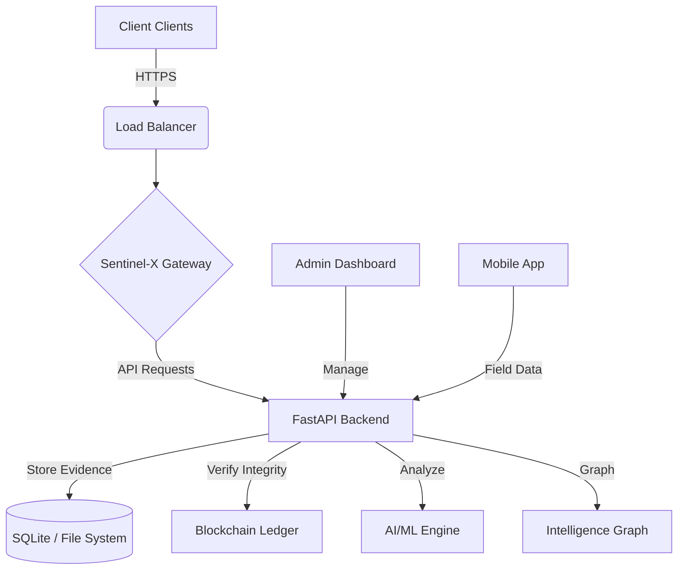

# Sentinel-X: Advanced Forensic Intelligence Platform

> **Next-Generation Digital Forensics & Threat Intelligence System**
> Real-time evidence analysis, blockchain-verified chain of custody, and AI-driven threat correlation.


---

## 📑 Table of Contents
- [Architecture Overview](#architecture-overview)
- [Backend Features](#backend-features)
- [Frontend Features](#frontend-features)
- [Mobile Integration](#mobile-integration)
- [Installation & Setup](#installation--setup)
- [API Documentation](#api-documentation)
- [Code Reference Guide](#code-reference-guide)

---

## 🏗️ Architecture Overview



Sentinel-X utilizes a microservices-inspired architecture:
- **Backend**: Python (FastAPI) handling complex forensic logic, hashing, and graph analysis.
- **Frontend**: React (Vite) with a custom Glassmorphism UI system.
- **Mobile**: Android application for field evidence collection.
- **Intelligence**: Integrated graph database for linking suspects, devices, and IOCs.

---

## 🔧 Backend Features

### 1. **Core Evidence Processing**

#### Blockchain Ledger Integrity
**File:** `backend/core/blockchain/ledger.py`

| Feature | Description |
|---------|-------------|
| **Genesis Block** | Initializes the immutable chain for evidence tracking. |
| **Hash Chaining** | Links new evidence blocks to previous hashes (SHA-256). |
| **Tamper Detection** | Verifies chain integrity to detect unauthorized modifications. |

```python
# backend/core/blockchain/ledger.py
class BlockchainLedger:
    def add_block(self, data):
        previous_hash = self.get_last_block().hash
        new_block = Block(data, previous_hash)
        self.chain.append(new_block)
        return new_block.hash
```

---

### 2. **AI & Forensic Analysis**

#### Evidence Processor
**File:** `backend/services/evidence_processor.py`

| Component | Functionality |
|-----------|---------------|
| **File Extraction** | Extracts metadata (EXIF, hashes) from uploaded files. |
| **YARA Scanning** | Scans files against malware method signatures. |
| **Classification** | AI model classifies file types and potential threats. |

#### Graph Intelligence
**File:** `backend/core/intelligence/graph.py`

Maps relationships between entities (Suspects, IP Addresses, Files) to visual clusters of criminal activity.

---

### 3. **API Layer**

#### V1 API Endpoints
**File:** `backend/api/v1/evidence.py` & `backend/api/v1/analytics.py`

| Endpoint | Method | Purpose |
|----------|--------|---------|
| `/evidence/upload` | POST | Secure file upload with chain-of-custody logging. |
| `/analytics/graph` | GET | Retrieve node-link data for visualization. |
| `/auth/token` | POST | JWT authentication for secure access. |

---

## 🎨 Frontend Features

### 1. **Glassmorphism Design System**

**File:** `Sentinel_X_Frontend/cyber-sentinel-67/src/index.css` & `components/ui/GlassCard.tsx`

Custom UI components built with TailwindCSS to provide a futuristic, translucent "glass" effect.

```tsx
// src/components/ui/GlassCard.tsx
export const GlassCard = ({ children, className }) => (
  <div className={`backdrop-blur-md bg-white/10 border border-white/20 rounded-xl ${className}`}>
    {children}
  </div>
);
```

### 2. **Real-Time Dashboard**

**File:** `Sentinel_X_Frontend/cyber-sentinel-67/src/pages/Dashboard.tsx`

| Section | Component | Description |
|---------|-----------|-------------|
| **System Health** | `SystemHealth.tsx` | CPU/Mem/Net visualizations using Recharts. |
| **Recent Incidents** | `RecentIncidents.tsx` | timeline of latest forensic alerts. |
| **Custody Timeline** | `CustodyTimeline.tsx` | Visual chain of custody for evidence. |

---

## 📱 Mobile Integration

**Path:** `sentinel_mobile_source/`

The Sentinel-X mobile app (Android) allows field agents to:
1.  **Capture Evidence**: Take photos/videos securely.
2.  **Tag Metadata**: Add GPS and timestamp data automatically.
3.  **Secure Upload**: Direct encrypted upload to the Sentinel-X backend.

---

## 📦 Installation & Setup

### Prerequisites
- Python 3.10+
- Node.js 18+
- Android Studio (optional, for mobile app)

### 1. Backend Setup

```bash
cd backend
python -m venv venv
source venv/bin/activate  # or venv\Scripts\activate on Windows
pip install -r requirements.txt

# Start the API Server
./start_backend.sh
# OR
uvicorn main:app --reload --host 0.0.0.0 --port 8000
```

### 2. Frontend Setup

```bash
cd Sentinel_X_Frontend/cyber-sentinel-67
npm install

# Start Development Server
npm run dev
```

### 3. Accessing the Platform
- **Web Interface**: `http://localhost:5173`
- **API Documentation**: `http://localhost:8000/docs`
- **Admin Dashboard**: `http://localhost:5174` (if running separately)

---

## 🔗 API Documentation

### Key Endpoints

#### Authentication
```http
POST /api/v1/auth/token
Body: { "username": "admin", "password": "***" }
Response: { "access_token": "ey...", "token_type": "bearer" }
```

#### Upload Evidence
```http
POST /api/v1/evidence/upload
Content-Type: multipart/form-data
Files: file=@evidence.jpg
Response: {
  "id": "ev_12345",
  "hash": "a1b2c3d4...",
  "blockchain_tx": "tx_98765"
}
```

---

## 📚 Code Reference Guide

### Directory Structure

```
SENTINEL_X/
├── backend/                  # Python FastAPI Core
│   ├── api/                  # Route Controllers
│   ├── core/                 # Blockchain & Graph Engines
│   ├── models/               # SQLModel Database Schemas
│   └── services/             # Business Logic (AI, Extraction)
├── Sentinel_X_Frontend/      # React Web App
│   ├── src/components/       # Reusable UI Components
│   ├── src/pages/            # Main Application Views
│   └── src/services/         # API Client Integration
└── sentine_mobile_source/    # Android Kotlin Project
```

### Key Algorithms

- **Hash-Chain Verification**: `backend/core/blockchain/ledger.py`
- **Graph Node Correlation**: `backend/core/intelligence/graph.py`
- **Evidence Risk Scoring**: `backend/services/evidence_processor.py`

---

## 🚀 Feature Matrix

| Feature | Backend Service | Frontend Component | Status |
|---------|-----------------|--------------------|--------|
| **Auth** | `AuthService` | `Login.tsx` | ✅ Ready |
| **Evidence** | `EvidenceProcessor` | `EvidenceForm.tsx` | ✅ Ready |
| **Blockchain** | `Ledger` | `CustodyTimeline.tsx` | ✅ Ready |
| **Analytics** | `GraphEngine` | `SystemHealth.tsx` | ✅ Ready |
| **Mobile** | `API (Upload)` | `Mobile App (Kotlin)` | 🚧 Beta |

---

> **Note**: This is a proprietary system for authorized forensic personnel only.
